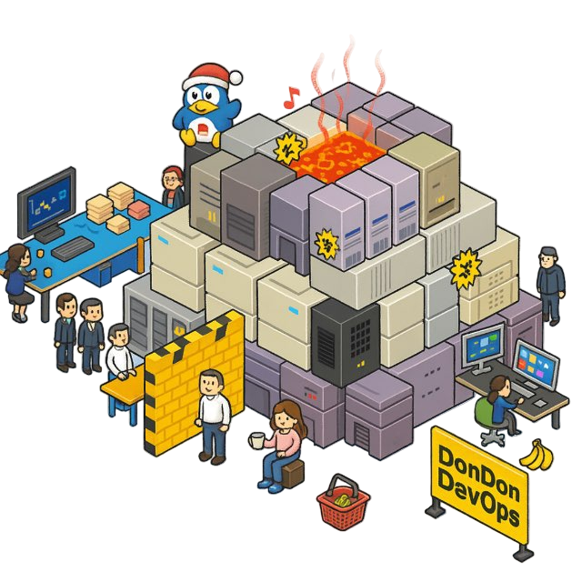

# DonDonDevOps




# Project Description
DonDonDevOps is a microservices-based point-of-sales platform for retail teams. While the codebase is now retired, it demonstrates the team's DevOps-first mindset of: flow, feedback, and continuous learning + experimentation. Our rapid iteration is supported by CI/CD practices grounded in a strong testing culture and focused documentation approach.

## Overview
- Purpose-built for Singapore Management University's CS302 Information Technology Lifecycle Management (DevOps) module (Submission under Team G1T8)
- Focused on resilient in-store POS flows such as payments, efficient & automate stock management, and operational dashboards
- Retired but preserved as a learning artifact and project highlight covering architecture, automation, and delivery practices

## Highlights
- Tied for *Best Project Presentation* at the CS302 showcase, underscoring the team's ability to communicate DevOps outcomes
- Complete microservices decomposition with versioned API contracts under `shared/api-contracts/`
- Cloud-native delivery on AWS with fully containerized workloads and infra definitions maintained through Terraform/Terraformer
- GitLab pipelines (SonarQube, unit tests, container builds, and deployments) ensured every merge was production ready

## Architecture & Tech Stack
- **Architecture**: Microservices communicating over REST with strict API versioning (e.g., `xyz/v1`)
- **Frontend & Services**: Next.js, FastAPI, Micronaut, Spring Boot
- **Languages**: TypeScript, Python, Java
- **Cloud**: AWS-managed services for compute, storage, and observability
- **Toolchain**: Docker & Docker Compose for consistent environments, Gradle for JVM builds, Stripe API for payments, GitHub for historical documentation (retired)

## Applied DevOps Practices
- **CI/CD & Automated Testing**: GitLab pipelines with SonarQube gates, automated tests, and per-service deployment tracks
- **Infrastructure as Code (IaC)**: Terraform modules plus Terraformer for drift detection and rapid provisioning
- **Service Health**: Mandatory `/health` endpoints and smoke tests for every deployable unit
- **Documentation**: Shared docs under `shared/docs/` capture runbooks, API contracts, and operational decisions
- **Collaboration**: Manual Discord/Telegram alert workflow procedure for major changes kept everyone aligned on rollout plans

## Development Workflow
- Clone or pull from each microservice directory rather than the monorepo root
- Follow the API contract when mocking/stubbing other services, and update your service's contract under `shared/api-contracts/` if you introduce breaking changes
- Use semantic API versioning in endpoint paths (`xyz/v1`) before merging
- Review `shared/docs/` for service-specific runbooks and notify the team on Telegram before major updates

## Getting Started

### Prerequisites
- AWS account with IAM credentials scoped for Terraform provisioning
- Terraform 1.5+, AWS CLI, and access to the remote state backend you intend to use
- Node.js 18+, npm or pnpm, and the Vite CLI (global `npm install -g vite` or local dev dependency)
- Java 21 with Gradle 8+ for the Micronaut, Spring Boot, and FastAPI services
- Docker Engine + Docker Compose v2 for local orchestration

### Configuration Files
Some application secrets are not tracked in Git. Create the following before running any commands:

1. `services/.env`
   ```ini
   STRIPE_API_KEY=<test-or-live-key>
   STRIPE_WEBHOOK_SECRET=<local-signing-secret>
   AWS_ACCESS_KEY_ID=<local-or-sandbox-key>
   AWS_SECRET_ACCESS_KEY=<local-or-sandbox-secret>
   ```
   These values are injected into the payment service via `docker-compose.yml`.

2. `services/frontend/.env` and `services/frontend/.env.production`
   ```bash
   # .env (local)
   VITE_API_BASE_URL=http://localhost:8084
   VITE_STRIPE_PUBLISHABLE_KEY=<pk_test_xxx>
   VITE_COGNITO_DOMAIN=<your-dev-domain>

   # .env.production (release candidate)
   VITE_API_BASE_URL=https://api.<your-domain>
   VITE_STRIPE_PUBLISHABLE_KEY=<pk_live_xxx>
   VITE_COGNITO_DOMAIN=<your-prod-domain>
   ```
   Vite reads these files automatically and the GitLab pipeline promotes `.env.production` during the build job.

3. `infrastructure/terraform.tfvars`
   ```hcl
   aws_region        = "ap-southeast-1"
   state_bucket      = "<s3-state-bucket>"
   domain_name       = "pos.<your-domain>"
   hosted_zone_id    = "<route53-zone-id>"
   stripe_webhook    = "<prod-webhook-secret>"
   postgres_username = "<db-user>"
   postgres_password = "<strong-password>"
   ```
   Keep this file encrypted or in a secure secret manager if you collaborate across teams.

### Local Development (Docker Compose)
Use Compose when you want the entire stack, including DynamoDB Local, RabbitMQ, and all microservices, running on your workstation.

```bash
cd services
docker compose --env-file .env up --build
docker compose logs -f frontend  # optional: follow UI logs
```

- Restart a single service with `docker compose up -d --build inventory-service`.
- Shut down the stack when done: `docker compose down -v`.
- Remember to re-run Gradle builds inside each Java service if you change dependencies (`./gradlew build`).

### Production-Intent Local Development (Vite)
When you need to test the frontend exactly as GitLab would before a production push, rely on the Vite tooling baked into the frontend service.

```bash
cd services/frontend
npm install
npm run build              # static asset build that hooks into Vite
npx vite preview --host 0.0.0.0 --port 4173 --https
```

- The preview server proxies API calls to the URLs defined in `.env.production`; adjust `VITE_API_BASE_URL` if you need to target staging.
- Commit the resulting `.next` (build) artifacts only if you are preparing a release bundle; otherwise keep them ignored.
- GitLab mirrors these steps in `frontend/.gitlab-ci.yml`, so keeping the local workflow identical reduces "works on my machine" drift.

### Deployment (Terraform)
Infrastructure lives under `infrastructure/` and can be applied end-to-end with Terraform.

```bash
cd infrastructure
terraform init
terraform fmt -recursive
terraform plan  -var-file=terraform.tfvars
terraform apply -var-file=terraform.tfvars
```

- Always review `plan` output, especially for imported resources generated by Terraformer in `infrastructure/generated/`.
- Use targeted applies (`terraform apply -target=module.payments`) when rotating credentials to avoid touching the entire estate.
- Destroy only non-production environments and always confirm `state_bucket` backups are healthy before doing so.

## Launching New or Experimental Services
- Provide a `Dockerfile` plus dependencies manifest (`requirements.txt`, `package.json`, or Gradle module as relevant)
- Create a dedicated GitLab CI/CD pipeline so tests, scans, and deploys stay service-scoped
- Expose a `/health` endpoint to support automated monitors and environment smoke tests

## Tooling & Environments for Local Development (Project History) 
- **Developer OS**: Windows, macOS, and Debian-based Linux
- **IDEs**: IntelliJ IDEA, VS Code, Neovim
- **Version Control**: Git with GitLab as the production remote
- **AI & Design**: OpenAI Codex for assisted coding and Figma Make for rapid UI ideation, DALLE for Logo Image Generation
- **Custom Docker dev containers** were researched to standardize onboarding but were ultimately retired with the project

## Contributors
G1 Team 8 (Team Don Don Donki / Team International Chefs)
- [ALSON SIM WEI JIE](https://github.com/Xskullibur)
- [BILL JOHNATHAN](https://github.com/billjohnathan8)
- [CODY JEOW TENG XIANG](https://github.com/Codyjtx)
- [JEREMY LIM JIN ZHAI](https://github.com/JLJZ)
- [NG GUO FENG ERIC](https://github.com/theofficialericng)
- [SIM KAH HONG](https://github.com/kahhong)
