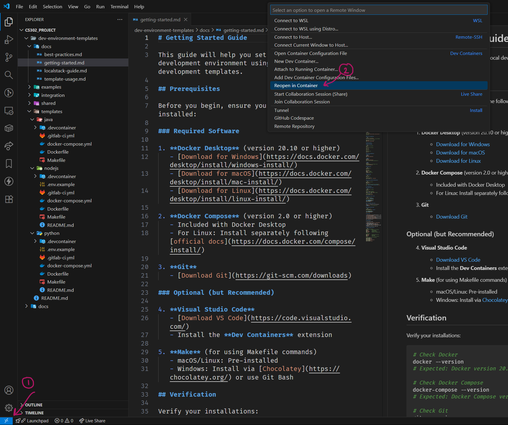

# Development Environment Templates

This repository contains Docker-based development environment templates for microservices development with LocalStack integration.

## Repository Structure

```
dev-environment-templates/
├── templates/          # Tech stack-specific templates
│   ├── nodejs/        # Node.js/TypeScript template
│   ├── python/        # Python template
│   ├── java/          # Java/Kotlin template
│   ├── go/            # Go template
│   └── dotnet/        # .NET template
├── integration/       # Multi-service integration environment
├── shared/           # Shared configurations and utilities
│   ├── localstack/   # LocalStack configurations
│   ├── scripts/      # Helper scripts
│   └── configs/      # Common configuration files
├── docs/             # Documentation
└── examples/         # Example microservices using templates
```

## Quick Start

1. **Choose a template** based on your microservice's tech stack
2. **Copy the template** to your microservice repository
3. **Customize** the configuration for your specific needs
4. **Start developing** using either VS Code Dev Containers or Docker Compose

## Usage Modes

### VS Code Dev Containers (Recommended)
Open your microservice in VS Code and select "Reopen in Container"


### Docker Compose
```bash
make up        # Start development environment
make shell     # Enter container shell
make logs      # View logs
make down      # Stop environment
```

## Documentation

- [Getting Started Guide](docs/getting-started.md)
- [Template Usage Guide](docs/template-usage.md)
- [LocalStack Configuration](docs/localstack-guide.md)
- [Integration Environment](docs/integration-guide.md)
- [Best Practices & Troubleshooting](docs/best-practices.md)

## Requirements

- Docker Desktop 20.10+
- Docker Compose 2.0+
- VS Code with Dev Containers extension (optional)
- Git

## Support

For issues and questions, please refer to the [Troubleshooting Guide](docs/best-practices.md#troubleshooting)
